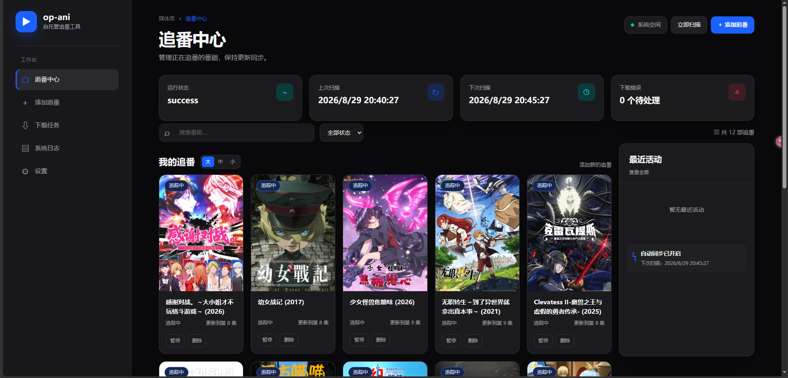
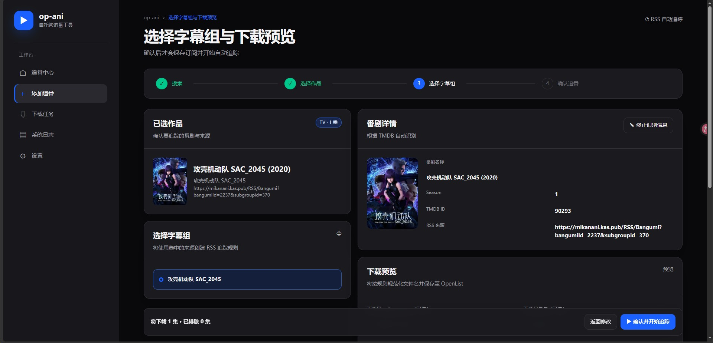

<p align="center">
  
</p>

<h1 align="center">OpenList-Ani · op-ani</h1>

<p align="center">
  <b>从找番、识别、过滤，到网盘下载和规范命名的一站式追番工具</b>
</p>

<p align="center">
  本仓库是基于上游 OpenList-Ani 的个人整合版，重点服务于 OpenList + 迅雷/夸克等网盘 + SmartStrm + Jellyfin 的媒体库工作流。
</p>

---

## 这是什么

op-ani 负责“发现资源”和“创建下载任务”，不负责保存媒体文件，也不是播放器。

它从 Mikan 或其他 RSS 获取更新，识别番剧信息，按规则过滤资源，经用户确认后交给 OpenList 离线下载，再按 Emby/Jellyfin 友好的格式整理名称和目录。

```text
Mikan / RSS
    ↓
op-ani：识别、TMDB 校验、LLM 改名、过滤、预览
    ↓
OpenList：创建离线下载任务并保存到目标网盘
    ↓
SmartStrm：把网盘文件生成 STRM
    ↓
Jellyfin / VidHub / 其他客户端播放
```

SmartStrm、Jellyfin 和播放器都不是 op-ani 的硬依赖。只使用 OpenList 下载时，op-ani 也可以单独运行。

## 我们这版做了什么

### 网页端追番入口

- 在首页通过 Mikan 搜索番剧、选择字幕组，并生成对应 RSS。
- 粘贴 RSS 后先进入独立的“识别与下载预览”弹窗。
- 预览 TMDB 结果、年份、季度、TMDB ID、海报、改名结果和完整下载目录。
- 确认后才保存订阅，并立即触发一次新订阅扫描。

### RSS 过滤与订阅管理

- 全局排除规则对所有 RSS 生效。
- 单个 RSS 可以设置独立排除规则，多个规则支持用 `|` 分隔。
- 预览会展示总条目数、排除数量和确认后会下载的条目。
- 支持立即扫描、暂停/恢复、修正 RSS 和删除订阅。
- 已添加订阅会显示当前状态、最近扫描、下一次扫描和完整下载目录。

### LLM + TMDB 媒体识别

- LLM 从资源标题中提取番剧名、季度、集数、字幕组、画质和语言。
- TMDB 用于确认具体作品、年份和 TMDB ID。
- 支持在确认前修改 `anime_name` 和下载目录名，处理敏感名称或自定义媒体库命名。
- 默认命名格式为 `番剧名 - S01E01`，也可以在设置中调整。

### 下载与任务可靠性

- 支持 RSS 磁力/种子任务和网页上传 `.torrent`。
- 下载前会应用过滤、清晰度优先级、字幕组优先级和已下载去重。
- 任务有最大重试次数，失败后会明确标记，不会无限重试。
- 运行日志在网页端可查看，便于定位 OpenList 或网盘侧失败。

### 可选能力

- Telegram、微信 iLink、飞书/Lark、PushPlus 通知。
- Telegram、微信 iLink、飞书/Lark 智能助理。
- Mikan 站点地址可在设置中修改，默认使用 `https://mikanani.kas.pub/`。
- `deploy/xunlei-token-bridge/` 提供 OpenList 与 SmartStrm 迅雷令牌同步桥，适用于两者共用轮换令牌的部署。

## 最快上手

### 准备工作

1. 部署 OpenList，并确认离线下载功能和目标网盘可用。
2. 准备 OpenList 地址和管理令牌。
3. 准备 Mikan RSS，或直接使用网页端的 Mikan 搜索入口。
4. 推荐准备 OpenAI 兼容的 LLM API Key 和 TMDB API Key。

没有 LLM 时，op-ani 会退回到正则解析，再使用 TMDB 做校验；复杂或格式不统一的资源建议启用 LLM。

### 源码安装

```bash
git clone https://github.com/PainKiller0x0/Openlist-Ani.git
cd Openlist-Ani

uv sync --no-dev --frozen
cp config.toml.example config.toml
uv run openlist-ani
```

启动后访问配置中的 `backend.host:backend.port`，默认是：

```text
http://127.0.0.1:26666
```

如果要从其他设备访问，需要把 `backend.host` 改为 `0.0.0.0`，并通过反向代理或防火墙限制访问范围。

### 最小配置

```toml
[backend]
host = "127.0.0.1"
port = 26666

[rss]
interval_time = 300

[openlist]
url = "http://127.0.0.1:5244"
token = "你的 OpenList 令牌"
download_path = "/迅雷/videos/番"
offline_download_tool = "Thunder"
rename_format = "{anime_name} - S{season:02d}E{episode:02d}"

[metadata_parser]
provider = "llm"

[metadata_validator]
provider = "tmdb"

[llm]
openai_api_key = "你的 LLM API Key"
openai_base_url = "https://api.openai.com/v1"
openai_model = "你的模型名"
tmdb_language = "zh-CN"

[mikan]
base_url = "https://mikanani.kas.pub/"
```

完整配置请参考 [`config.toml.example`](config.toml.example) 和 [`docs/配置说明.md`](docs/配置说明.md)。不要把真实 API Key、OpenList 令牌或机器人令牌提交到 Git 仓库。

## 网页端使用流程

### 方式一：从 Mikan 搜索

1. 在首页输入番剧名。
2. 选择正确的番剧和字幕组。
3. op-ani 自动生成 RSS 并进入预览。
4. 确认 TMDB、年份、季度、改名结果和下载目录。
5. 点击确认，保存订阅并立即开始追踪。

### 方式二：直接添加 RSS

1. 在首页粘贴 RSS 地址。
2. 点击“识别并预览”。
3. 在弹窗中设置全局/单订阅排除规则、`anime_name` 和下载目录名。
4. 检查过滤后的资源列表和最终下载路径。
5. 确认后保存；之后由轮询器自动处理新条目。

### 方式三：上传种子

在首页选择 `.torrent` 文件，可选填写任务名称和目标目录。op-ani 会解析种子内容，并复用现有 OpenList 离线下载流程。

## 配置建议

### 轮询间隔

`rss.interval_time` 单位是秒，默认 300 秒，即 5 分钟。网页设置中的修改会立即作用于新的轮询周期。

### 资源优先级

可以通过 `rss.priority` 设置字幕组、画质和语言的比较顺序。同一番剧同一集出现多个版本时，优先级过滤器会尽量只保留更合适的一份。

### 命名格式

可用字段包括：

```text
anime_name、season、episode、fansub、quality、languages、version
```

常用示例：

```text
{anime_name} - S{season:02d}E{episode:02d}
{anime_name} S{season:02d}E{episode:02d} {fansub} {quality} {languages}
```

### OpenList 地址切换

网页设置会先验证 OpenList 地址、令牌、离线下载工具和目标目录。任一项验证失败，本次修改不会保存。

已有任务保留创建时的下载目录；修改默认目录只影响之后新建的任务。

## SmartStrm / Jellyfin 联动

op-ani 下载完成后，OpenList 中会出现真实媒体文件。SmartStrm 再扫描对应目录，生成指向网盘直链解析服务的 STRM 文件，Jellyfin 负责媒体库索引和播放入口。

推荐把 op-ani 的下载根目录直接设置为 SmartStrm 正在扫描的网盘目录，例如：

```text
/迅雷/videos/番
```

如果 OpenList 和 SmartStrm 共用迅雷账号令牌，建议安装令牌同步桥：

```text
deploy/xunlei-token-bridge/
```

它只负责令牌轮换后的同步，不负责转存、刮削或播放。迅雷主动撤销授权或要求验证码时，仍需人工重新授权一次。

## 部署方式

- **源码/uv**：适合开发、调试和修改本项目。
- **Docker/Podman**：适合 VPS 或 NAS 长期运行，配置和 `data/` 目录需要持久化。
- **systemd**：适合 Linux 主机上的后台自启动。

详细说明：

- [`docs/快速开始.md`](docs/快速开始.md)
- [`docs/Docker部署指南.md`](docs/Docker部署指南.md)
- [`docs/PIP安装指南.md`](docs/PIP安装指南.md)
- [`docs/源码编译指南.md`](docs/源码编译指南.md)
- [`docs/配置说明.md`](docs/配置说明.md)
- [`docs/追番入口.md`](docs/追番入口.md)
- [`deploy/xunlei-token-bridge/README.md`](deploy/xunlei-token-bridge/README.md)

## 数据与安全

- `data/` 保存任务状态、媒体库识别结果、运行日志和上传种子。
- `config.toml` 可能包含 OpenList 令牌、LLM Key、通知机器人令牌，不应提交到 Git。
- 上传的种子保存在 `data/uploads/`，确认任务完成后可以按需清理。
- 对外提供网页访问时，建议使用 HTTPS、反向代理和访问控制，不要直接暴露带有管理能力的后端端口。

## 开发与测试

安装开发依赖：

```bash
uv sync
```

运行测试：

```bash
uv run pytest
```

代码格式和静态检查：

```bash
uv run ruff check .
uv run black --check .
```

## 项目关系

本仓库基于上游 [TwooSix/Openlist-Ani](https://github.com/TwooSix/Openlist-Ani) 继续维护，并保留原项目的基础架构和许可证信息。

本版本的重点是把 Mikan 搜索、RSS 预览、LLM/TMDB 识别、可控命名、OpenList 下载和迅雷令牌联动整合成一条可以长期运行的追番工作流。

## 截图

| 追番预览 | 任务与识别 |
| :---: | :---: |
|  |  |
